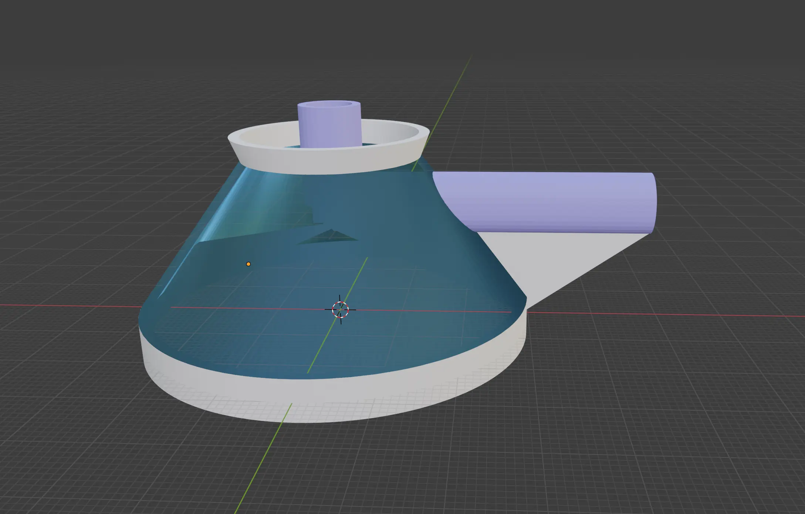
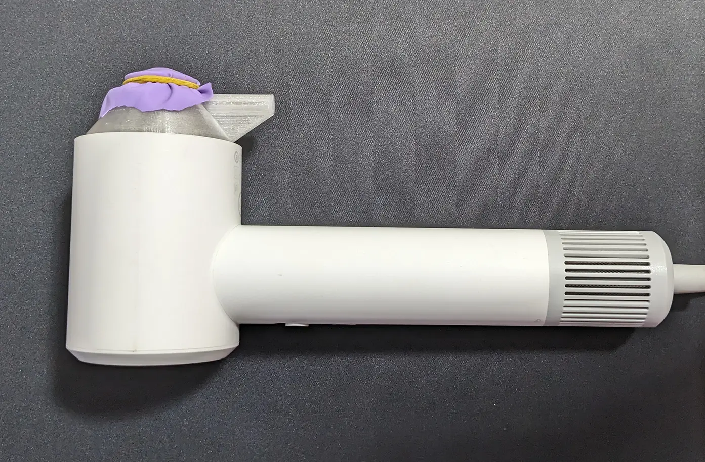

# 电动笛子！

大家有吹过笛子吗？

用嘴吹笛子很累，而且不是很卫生。所以聪明的莉沫酱发明了电动笛子，用吹风机来吹！这样1来就不用用嘴吹笛子啦！

## 模型

模型是这样——

结构是这样:

下面是进气口，这个模型是没有底面的。

气流从下面进去之后，会到顶部(得用1个笛膜把上面封住)，这个时候膜会被顶起来。然后气流就可以通过蓝色的管，从右边的出气口出来，导致模型内部的气压下降，膜又回到原本的位置。

这样1来，膜会快速上下震动，就会发出声音啦！

笛膜的话，可以打印出来之后，把1个有弹性的膜固定在上面，我自己是用橡皮筋绑了1块气球的皮。

然后模型底部有卡扣，是用来固定在[米家吹风机](https://item.jd.com/100066192247.html)的头上的，最后的成品像是这样——

顺便说1下，那个蓝色的管的部分原本应该是比较长，然后有打几个孔的，这样才能用手按住1些孔来控制频率。但是我不知道怎么去调这个音高，总不能打印很多份1个1个钻孔试吧……所以就先不做这个部分了。

## 使用方式

打开吹风机的开关就可以了。

但是因为是高速吹风机，声音超级大，开起来以后等下整栋楼的人都会来打你！

如果你真的很想开的话，可以先锻炼身体，这样他们就打不过你啦！

## 结束

就这样，我去和楼上的人打架了，大家88！
